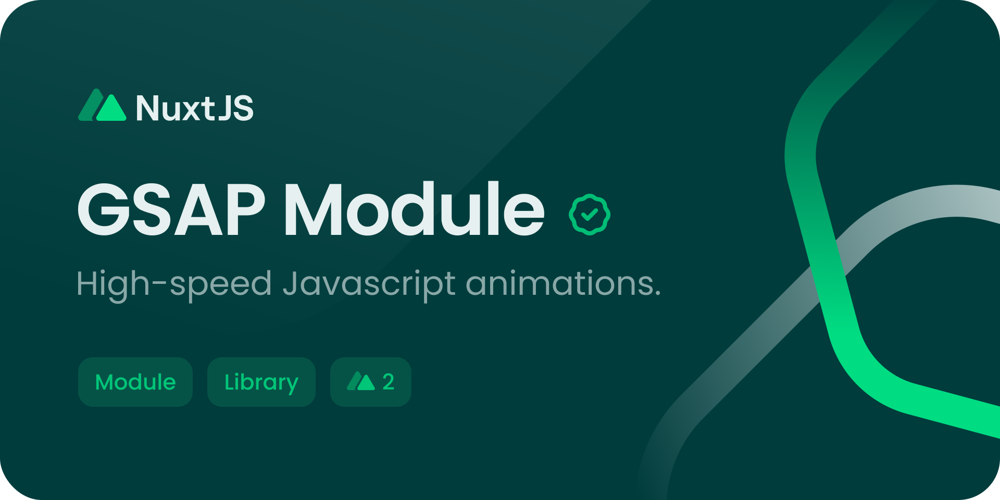

<p align="center">
    
</p>

<h1>Nuxt GSAP Module</h1>

GSAP module for Nuxt.js

## Features

- Helps you integrate `GSAP` javascript animation library
- Allows you to easily animate elements via custom `v-gsap` directive 🔥
- Provides a solution for global use via `this.$gsap`
- Automatically registers plugins after activation
- Supports `Club GreenSock` premium plugins
- `Zero-config` setup ready to go 🚀

## Quick Start

1. Add `nuxt-gsap-module` dependency to your project

```bash
$ npm install --save-dev nuxt-gsap-module # or yarn add --dev nuxt-gsap-module
```

2. Add `nuxt-gsap-module` to the `buildModules` section of `nuxt.config.js`

```js
// nuxt.config.js

export default {
  buildModules: ['nuxt-gsap-module'],

  gsap: {
    /* module options */
  }
}
```

That's it! Start developing your app ✨

## Examples

Here are some code examples

- [Basic](https://github.com/ivodolenc/nuxt-gsap-module/tree/master/examples/basic)
- [Custom Directive](https://github.com/ivodolenc/nuxt-gsap-module/tree/master/examples/custom-directive)
- [Page Transitions](https://codesandbox.io/s/example-nuxt-gsap-module-basic-bqi7c)
- [Staggering](https://github.com/ivodolenc/nuxt-gsap-module/tree/master/examples/staggering)
- [Animate On Scroll](https://github.com/ivodolenc/nuxt-gsap-module/tree/master/examples/animate-on-scroll)

### Custom modifier: `v-gsap.set`

```html
<!-- index.vue -->

<template>
  <p v-gsap.set="{ x: 100, y: 50 }">NUXT GSAP</p>
</template>
```

[More info](https://greensock.com/docs/v3/GSAP/gsap.set)

### Custom modifier: `v-gsap.to`

```html
<!-- index.vue -->

<template>
  <h1
    v-gsap.to="{
      rotation: 360,
      x: 150,
      duration: 2
    }"
  >
    NUXT GSAP
  </h1>
</template>
```

[More info](https://greensock.com/docs/v3/GSAP/gsap.to)

### Custom modifier: `v-gsap.from`

```html
<!-- index.vue -->

<template>
  <span
    v-gsap.from="{
      opacity: 0, 
      x: -200, 
      duration: 1
    }"
  >
    NUXT GSAP
  </span>
</template>
```

[More info](https://greensock.com/docs/v3/GSAP/gsap.from)

### Custom modifier: `v-gsap.fromTo`

```html
<!-- index.vue -->

<template>
  <p
    v-gsap.fromTo="[
      { opacity: 0, y: -350 },
      { opacity: 1, y: 0, duration: 3 }
    ]"
  >
    NUXT GSAP
  </p>
</template>
```

[More info](https://greensock.com/docs/v3/GSAP/gsap.fromTo)

### Simple box rotation

```js
// index.vue

{
  mounted() {
    this.boxRotation()
  },

  methods: {
    boxRotation() {
      const gsap = this.$gsap
      gsap.to('.box', { rotation: 27, x: 100, duration: 1 })
    }
  }
}
```

### Nuxt global page transitions

```js
// nuxt.config.js

{
  // Enable module
  buildModules: ['nuxt-gsap-module'],

  // Add global page transition
  pageTransition: {
    name: 'page',
    mode: 'out-in',
    css: false,

    beforeEnter(el) {
      this.$gsap.set(el, {
        opacity: 0
      })
    },

    enter(el, done) {
      this.$gsap.to(el, {
        opacity: 1,
        duration: 0.5,
        ease: 'power2.inOut',
        onComplete: done
      })
    },

    leave(el, done) {
      this.$gsap.to(el, {
        opacity: 0,
        duration: 0.5,
        ease: 'power2.inOut',
        onComplete: done
      })
    }
  }
}
```

### Multiple plugins usage example

✅ The module automatically registers plugins globally (after plugin activation in the settings), so you won’t have to worry about it (applies to all plugins).

```js
// nuxt.config.js

{
  gsap: {
    extraPlugins: {
      /**
       * After activation, plugins are automatically
       * registered and available globally
       */
      scrollTo: true,
      scrollTrigger: true
    },
    extraEases: {
      expoScaleEase: true
    }
  }
}
```

```js
// Usage

export default {
  mounted() {
    this.animateOnScroll()
  },

  methods: {
    animateOnScroll() {
      this.$gsap.to(window, { duration: 2, scrollTo: 1000 })

      this.$gsap.to('.box', {
        x: 500,
        ease: 'Power1.easeInOut',
        scrollTrigger: {
          trigger: '.content',
          pin: true,
          end: 'bottom',
          scrub: true
        }
      })
    }
  }
}
```

## Options

**Default options**

```js
// nuxt.config.js

{
  gsap: {
    extraPlugins: {
      cssRule: false,
      draggable: false,
      easel: false,
      motionPath: false,
      pixi: false,
      text: false,
      scrollTo: false,
      scrollTrigger: false
    },
    extraEases: {
      expoScaleEase: false,
      roughEase: false,
      slowMo: false,
    }
  }
}
```

## GSAP's core

### `gsap`

- Default: `true`

✅ GSAP's core is enabled by default so there is no need for additional configuration.

```js
// nuxt.config.js

{
  buildModules: ['nuxt-gsap-module']
}
```

**Available globally**

```js
// Access GSAP by using
this.$gsap

// or
const gsap = this.$gsap
gsap.to('.box', { rotation: 27, x: 100, duration: 1 })
```

**Use in templates**

```html
<div v-gsap.to="{ /* ... */ }"></div>
```

```html
<div v-gsap.from="{ /* ... */ }"></div>
```

```html
<div v-gsap.fromTo="[{ /* ... */ }, { /* ... */ }]"></div>
```

```html
<div v-gsap.set="{ /* ... */ }"></div>
```

## Extra Plugins

### `cssRule`

- Default: `false`

```js
// nuxt.config.js

{
  gsap: {
    extraPlugins: {
      cssRule: true
    }
  }
}
```

```js
// Access the plugin by using
this.$CSSRulePlugin
```

[More info](https://greensock.com/docs/v3/Plugins/CSSRulePlugin)

### `draggable`

- Default: `false`

```js
// nuxt.config.js

{
  gsap: {
    extraPlugins: {
      draggable: true
    }
  }
}
```

```js
// Access the plugin by using
this.$Draggable
```

[More info](https://greensock.com/docs/v3/Plugins/Draggable)

### `easel`

- Default: `false`

```js
// nuxt.config.js

{
  gsap: {
    extraPlugins: {
      easel: true
    }
  }
}
```

```js
// Access the plugin by using
this.$EaselPlugin
```

[More info](https://greensock.com/docs/v3/Plugins/EaselPlugin)

### `motionPath`

- Default: `false`

```js
// nuxt.config.js

{
  gsap: {
    extraPlugins: {
      motionPath: true
    }
  }
}
```

```js
// Access the plugin by using
this.$MotionPathPlugin
```

[More info](https://greensock.com/docs/v3/Plugins/MotionPathPlugin)

### `pixi`

- Default: `false`

```js
// nuxt.config.js

{
  gsap: {
    extraPlugins: {
      pixi: true
    }
  }
}
```

```js
// Access the plugin by using
this.$PixiPlugin
```

[More info](https://greensock.com/docs/v3/Plugins/PixiPlugin)

### `text`

- Default: `false`

```js
// nuxt.config.js

{
  gsap: {
    extraPlugins: {
      text: true
    }
  }
}
```

```js
// Access the plugin by using
this.$TextPlugin
```

[More info](https://greensock.com/docs/v3/Plugins/TextPlugin)

### `scrollTo`

- Default: `false`

```js
// nuxt.config.js

{
  gsap: {
    extraPlugins: {
      scrollTo: true
    }
  }
}
```

```js
// Access the plugin by using
this.$ScrollToPlugin
```

[More info](https://greensock.com/docs/v3/Plugins/ScrollToPlugin)

### `scrollTrigger`

- Default: `false`

```js
// nuxt.config.js

{
  gsap: {
    extraPlugins: {
      scrollTrigger: true
    }
  }
}
```

```js
// Access the plugin by using
this.$ScrollTrigger
```

[More info](https://greensock.com/docs/v3/Plugins/ScrollTrigger)

## Extra eases

### `expoScaleEase`

- Default: `false`

```js
// nuxt.config.js

{
  gsap: {
    extraEases: {
      expoScaleEase: true
    }
  }
}
```

```js
// Access the plugin by using
this.$ExpoScaleEase
```

[More info](https://greensock.com/docs/v3/Eases/ExpoScaleEase)

### `roughEase`

- Default: `false`

```js
// nuxt.config.js

{
  gsap: {
    extraEases: {
      roughEase: true
    }
  }
}
```

```js
// Access the plugin by using
this.$RoughEase
```

[More info](https://greensock.com/docs/v3/Eases/RoughEase)

### `slowMo`

- Default: `false`

```js
// nuxt.config.js

{
  gsap: {
    extraEases: {
      slowMo: true
    }
  }
}
```

```js
// Access the plugin by using
this.$SlowMo
```

[More info](https://greensock.com/docs/v3/Eases/SlowMo)

## Club GreenSock

`nuxt-gsap-module` supports Club GreenSock premium plugins. They can be easily activated via `module` settings, just like the free ones.

**Installation**

1. Follow the [official](https://youtu.be/30CivTsqqMY?t=87) instructions and install the `premium` plugins as usual.
2. After installation, simply activate the desired plugins and that's it, you're ready to go!

### `customEase`

- Default: `false`

```js
// nuxt.config.js

{
  gsap: {
    clubPlugins: {
      customEase: true
    }
  }
}
```

```js
// Access the plugin by using
this.$CustomEase
```

[More info](https://greensock.com/docs/v3/Eases/CustomEase)

### `customBounce`

- Default: `false`

```js
// nuxt.config.js

{
  gsap: {
    clubPlugins: {
      customBounce: true
    }
  }
}
```

```js
// Access the plugin by using
this.$CustomBounce
```

[More info](https://greensock.com/docs/v3/Eases/CustomBounce)

### `customWiggle`

- Default: `false`

```js
// nuxt.config.js

{
  gsap: {
    clubPlugins: {
      customWiggle: true
    }
  }
}
```

```js
// Access the plugin by using
this.$CustomWiggle
```

[More info](https://greensock.com/docs/v3/Eases/CustomWiggle)

### `drawSVG`

- Default: `false`

```js
// nuxt.config.js

{
  gsap: {
    clubPlugins: {
      drawSVG: true
    }
  }
}
```

```js
// Access the plugin by using
this.$DrawSVGPlugin
```

[More info](https://greensock.com/docs/v3/Plugins/DrawSVGPlugin)

### `flip`

- Default: `false`

```js
// nuxt.config.js

{
  gsap: {
    clubPlugins: {
      flip: true
    }
  }
}
```

```js
// Access the plugin by using
this.$Flip
```

[More info](https://greensock.com/docs/v3/Plugins/Flip)

### `gsDevTools`

- Default: `false`

```js
// nuxt.config.js

{
  gsap: {
    clubPlugins: {
      gsDevTools: true
    }
  }
}
```

```js
// Access the plugin by using
this.$GSDevTools
```

[More info](https://greensock.com/docs/v3/Plugins/GSDevTools)

### `inertia`

- Default: `false`

```js
// nuxt.config.js

{
  gsap: {
    clubPlugins: {
      inertia: true
    }
  }
}
```

```js
// Access the plugin by using
this.$InertiaPlugin
```

[More info](https://greensock.com/docs/v3/Plugins/InertiaPlugin)

### `morphSVG`

- Default: `false`

```js
// nuxt.config.js

{
  gsap: {
    clubPlugins: {
      morphSVG: true
    }
  }
}
```

```js
// Access the plugin by using
this.$MorphSVGPlugin
```

[More info](https://greensock.com/docs/v3/Plugins/MorphSVGPlugin)

### `motionPathHelper`

- Default: `false`

```js
// nuxt.config.js

{
  gsap: {
    clubPlugins: {
      motionPathHelper: true
    }
  }
}
```

```js
// Access the plugin by using
this.$MotionPathHelper
```

[More info](https://greensock.com/docs/v3/Plugins/MotionPathHelper)

### `physics2D`

- Default: `false`

```js
// nuxt.config.js

{
  gsap: {
    clubPlugins: {
      physics2D: true
    }
  }
}
```

```js
// Access the plugin by using
this.$Physics2DPlugin
```

[More info](https://greensock.com/docs/v3/Plugins/Physics2DPlugin)

### `physicsProps`

- Default: `false`

```js
// nuxt.config.js

{
  gsap: {
    clubPlugins: {
      physicsProps: true
    }
  }
}
```

```js
// Access the plugin by using
this.$PhysicsPropsPlugin
```

[More info](https://greensock.com/docs/v3/Plugins/PhysicsPropsPlugin)

### `scrambleText`

- Default: `false`

```js
// nuxt.config.js

{
  gsap: {
    clubPlugins: {
      scrambleText: true
    }
  }
}
```

```js
// Access the plugin by using
this.$ScrambleTextPlugin
```

[More info](https://greensock.com/docs/v3/Plugins/ScrambleTextPlugin)

### `splitText`

- Default: `false`

```js
// nuxt.config.js

{
  gsap: {
    clubPlugins: {
      splitText: true
    }
  }
}
```

```js
// Access the plugin by using
this.$SplitText
```

[More info](https://greensock.com/docs/v3/Plugins/SplitText)

## License

**GSAP**

For more information, check the official GSAP site.

[GSAP License](https://greensock.com/licensing/)

Copyright (c) GreenSock

**Nuxt GSAP module**

[MIT License](LICENSE)

Copyright (c) Ivo Dolenc
